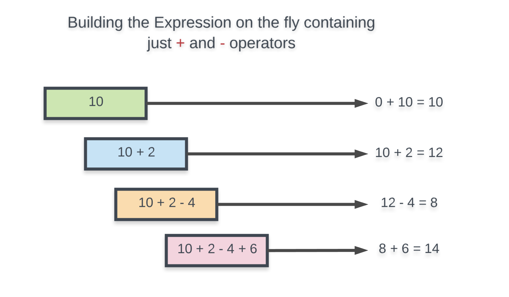
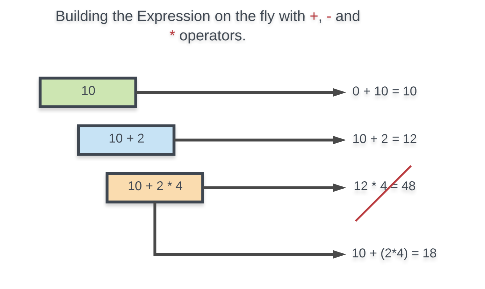
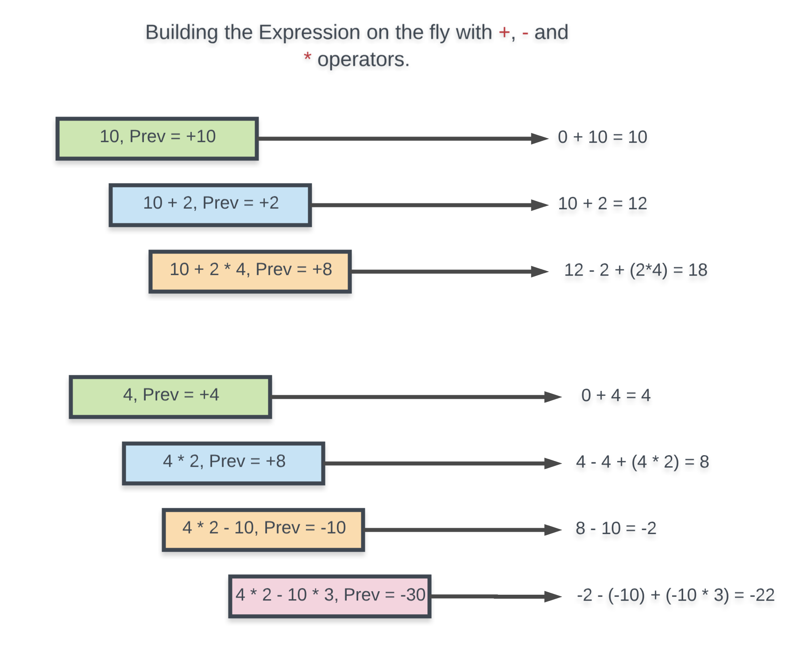

# evaluate-expression
There are three approaches to evaluate expression
1. Evaluate as running expression
2. Evaluate as infix expression
3. First convert into postfix/prefix then evaluate it  

# Evaluate expression on the fly
## Approach for same precedence
1. Implementation would be straight forward if only needs to handle `+` or `-` operator. 
2. This is because both of these operators has equal precedence. 
3. That means we can continue evaluating expression without any problem.


## Try with different precedence
1. Now let us add the * operator as well and see how building the expression on the fly like this breaks.

2. What we mean by building the expression on the fly is that we keep track of the expression's value till now and we simply consider that value as one of the two operands for our operators. 
3. As we can see from the two examples above, this would have worked had it just been + and - operators.
4. But, this approach is bound to fail because the * operator takes precedence over + and -. 
5.  The * operator would require the actual previous operand in our expression rather than the current value of the expression.
6.  i.e. In the above example, the * operator needed 2 rather than 12 to get us the correct value of 18.

## How to handle different precedence?
- We simply need to keep track of the last operand in our expression and how it modified the expression's value overall so that when we consider the * operator, we can reverse the effects of the previous operand and consider it for multiplication.
- Let's take a look at the example that was breaking before.


```
    switch(operator) {
        case '+':
            evaluated = evaluated + operandInt;
            prevOperand = operandInt;
            break;
        case '-':
            evaluated = evaluated - operandInt;
            prevOperand = operandInt * -1;
            break;
        case '*':
            evaluated = evaluated - prevOperand + prevOperand * operandInt;
            prevOperand = prevOperand * operandInt;
            break;
        case '/':
            const t = prevOperand >= 0? Math.floor(prevOperand / operandInt): Math.ceil(prevOperand / operandInt);
            evaluated = evaluated - prevOperand + t;
            prevOperand = t;
            break;
        default:                                                
    }
```
# Evaluate as infix expression
https://algorithms.tutorialhorizon.com/evaluation-of-infix-expressions/

# Problems
https://leetcode.com/problems/basic-calculator/

https://leetcode.com/problems/basic-calculator-ii/

https://leetcode.com/problems/basic-calculator-iii/

https://leetcode.com/problems/expression-add-operators/

https://leetcode.com/problems/evaluate-reverse-polish-notation/